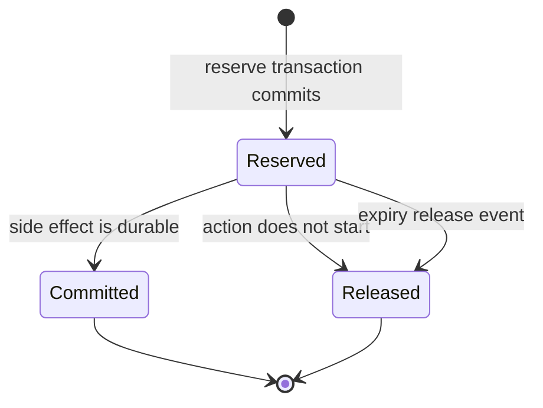

# PCP v0.1 — atomic budget ledger

This document defines the mutable authority state needed to enforce a portable grant. A signed grant states limits. The authoritative ledger serializes revocation and consumption.

Normative terms use RFC 2119 meanings.

## 1. Authority boundary

Every grant with a budget has one authoritative ledger history. A deployment MAY shard by `grant_id`; every operation for one grant MUST be linearizable. Acceptors that cannot reach the authoritative revocation and budget state MUST return `verification_unavailable` and MUST NOT start the action.

The reference code uses a process lock to make the state transition visible in tests. Production durability requires one of:

- a serializable database transaction keyed by `grant_id`;
- an atomic compare-and-swap with a monotonic fencing revision; or
- a single authoritative writer whose durable append completes before it replies.

Two isolated writers MUST NOT both authorize work against the same grant.

## 2. Integer units

Budgets use positive integers. The v0.1 units are:

| unit | representation |
| --- | --- |
| `usd_micros` | millionths of one US dollar |
| `api_calls` | calls |
| `model_tokens` | tokens |
| `milliseconds` | elapsed milliseconds |
| `actions` | discrete authority-spending actions |

Floating-point values are invalid. Each unit appears at most once in a grant or request. A reservation MUST name only units present on its grant.

## 3. State model

Each reservation has exactly one state:

`reserved` and `committed` amounts count against the limit. `released` amounts do not. A committed amount never returns to the grant. A compensating action uses its own grant authorization and receipt.

Reservation expiry never changes state silently. The ledger appends a `pcp_budget_release` with `reason_code: reservation_expired` before making the amount available.

## 4. Reserve

`pcp_budget_reserve_request` is the only budget operation that can authorize an action to begin. The verifier performs these checks in one serialized decision:

1. Parse JSON with duplicate-key rejection and validate the schema.
2. Verify the grant signature, subject kind, audience, purpose, scope, and time window.
3. Read the authoritative revocation revision. A matching effective revocation denies the request.
4. Resolve `(grant_id, idempotency_key)`.
5. Compare the canonical request digest and spend with any existing reservation.
6. Confirm `committed + reserved + requested <= limit` for every unit.
7. Append the signed reservation with the next `ledger_revision` durably.
8. Return the reservation only after the append commits.

The action MUST NOT begin before step 8. A verifier MUST recheck that the grant and reservation remain live immediately before an irreversible side effect. A revocation that linearizes before that check wins; the verifier releases the reservation.

## 5. Commit

After the side effect is durable, the executor submits `pcp_budget_commit_request`. The ledger MUST atomically append:

- one `pcp_budget_commit` referencing the reservation and result digest; and
- one signed `pcp_receipt` referencing the reservation, commit, request, result, grant, and action.

The implementation MAY use a transactional outbox when the receipt store is separate. It MUST withhold a success response until both records are durable. A revocation that linearizes after the side effect does not erase usage; the commit and receipt still record the completed act.

## 6. Release

If validation fails after reservation, Legatus rejects the envelope, the user cancels, or the executor proves that the side effect did not start, the executor submits `pcp_budget_release_request`. The ledger appends `pcp_budget_release` and restores the reserved amount.

Uncertain side-effect status MUST remain reserved until reconciliation or expiry. Releasing on uncertainty could authorize a duplicate side effect.

For the Legatus profile, `authorization_id` is the opaque reservation handle. The idempotency key is `legatus:` plus SHA-256 of the UTF-8 RFC 8785 JCS serialization of exactly `{thread, envelope_id}`, including the standard `sha256:` digest marker. The final form is `legatus:sha256:<64 lowercase hex>`. A finalization request rederives and validates this key from its thread and envelope ID. The profile adapter MUST also store both fields separately and compare them directly. The six-field proof request digest remains separate. `outcome: commit` requires a positive journal position. `outcome: release` requires a null journal position. A lost append CAS remains unresolved until a journal refresh establishes whether the same envelope became durable; presence commits and established absence releases.

The finalization transport MUST authenticate the same integration that obtained the reservation. The authorization handle is not a bearer credential. PCP validates journal evidence before commit, returns the original result for an identical replay, and denies a conflicting terminal outcome for reconciliation.

## 7. Idempotency and replay

`idempotency_key` is unique for the lifetime of a grant.

| repeated operation | result |
| --- | --- |
| same key, same canonical request digest, same spend | return the original reservation with no new event |
| same key, different digest or spend | `idempotency_conflict` |
| same commit, result digest, and receipt ID | return the original commit with no new event |
| commit replay with different result or receipt | `idempotency_conflict` |
| same release and reason | return the original release with no new event |
| reuse after release or reservation expiry | `reservation_not_live`; caller needs a new key |
| receipt ID seen twice | `replay_detected` |

The ledger MUST persist idempotency records at least as long as the grant, its receipts, and any applicable audit-retention period.

## 8. Subdelegation

v0.1 compares purpose as exact equality. Child actions and resources MUST be subsets of the parent sets. The child audience MUST equal the parent audience. The child time window MUST fit inside the parent window.

When a parent permits subdelegation, issuance of a budgeted child MUST reserve the child limits from the parent under `delegate:<child_grant_id>`. Unused child budget returns only after the child expires or is revoked and the ledger records a release. This prevents sibling grants from each claiming the same remaining parent budget.

## 9. Schemas and reference model

- Commands: [`../schemas/pcp-budget-command.schema.json`](../schemas/pcp-budget-command.schema.json)
- Legatus finalization: [request](../schemas/pcp-finalize-request.schema.json) and [result](../schemas/pcp-finalize-result.schema.json)
- Signed ledger events: [`../schemas/pcp.schema.json`](../schemas/pcp.schema.json)
- Executable state model: [`../pcp_reference/ledger.py`](../pcp_reference/ledger.py)
